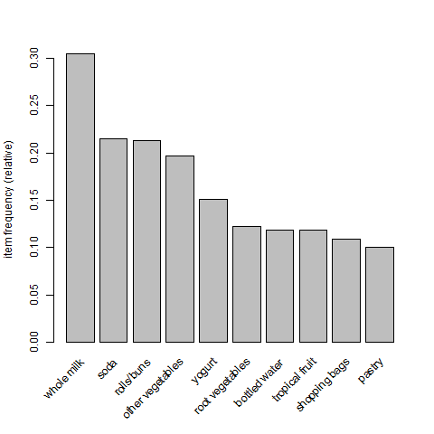

# Knn-Kmeans algorithms.
 K-NN and K-means algorithms: A Comprehensive Analysis of 1980s American Market Car Data.
From a dataset of 1000 transactions and more than 4600 articles the goal of this project was to come up with certain metrics such as support, confidence, lift, etc. Also find out what were the underlying consumption patterns in the dataset, the association rules were 
Listing association rules was also useful in identifying which transactions contained specific items and then they were printed using the 'arulesViz' package in R.

These are - in a nutshell - the main bullet points that have been approached:

+ **File reading (.CSV)**
+ **Check number of records and create overview table**
+ **Generate overview with relevant association rules filtered by 'Lift' value**
+ **Visualize the details with the plot function**
+ **Normalize file, excluding 'label' variable**
+ **Analyze minimum/maximum number of articles per shopping basket**
+ **Total number of purchased articles**
+ **Most purchased article**
+ **Duplicated articles**
+ **Relative frequency plots**
+ **Plotting association rules with different plots**
+ **Antecedents analysis: LHS & RHS**

# Summary

## Top 10 products

# Graphs filtered

# Matrix plots

# Plotly Interactive

# Support VS Confidence charts

 
 

